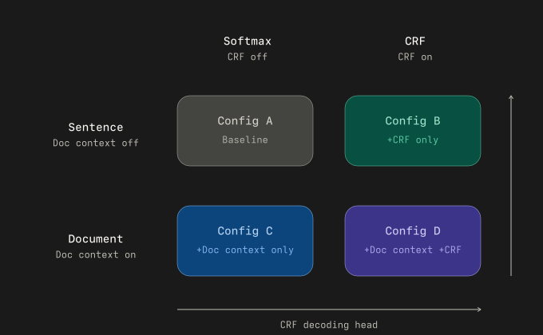

# ModernBERT NER Ablation

BERT and ModernBERT results (linear and CRF heads, sentence and document context) live under [`results/`](results/) (see **Results**).

Evaluating document-level context and CRF decoding in ModernBERT for CoNLL-2003 named entity recognition (NER).

Overleaf document: [moderbert-ner-ablation](https://www.overleaf.com/project/6996373c44b841199bc3c599)

## Abstract

We evaluate whether document-level context and CRF decoding provide additive or synergistic gains over sentence-level ModernBERT for named entity recognition on CoNLL-2003. Using a 2x2 factorial ablation (context on/off, CRF on/off), we compare entity-level F1 across all configurations and analyze which entity types benefit most from each modification.

### Ablations

We use two factors:

- Document context: off/on
- CRF decoding head: off/on



*Figure: Same design as the list below—**A** = baseline (sentence, softmax), **B** = +CRF only, **C** = +document context only, **D** = +document context and CRF.*

This yields four configurations (same labels as the figure, row-major: A and B on the sentence row, C and D on the document row):

1. **Config A —** Baseline ModernBERT (sentence-level, softmax; no CRF)
2. **Config B —** ModernBERT + CRF (sentence-level)
3. **Config C —** ModernBERT + document context (softmax)
4. **Config D —** ModernBERT + document context + CRF

Primary metric: entity-level F1 (seqeval), with per-entity-type F1 for PER/ORG/LOC/MISC.

## Results

**Last updated:** 2026-04-11. Primary metrics below come from the checked-in aggregates [`results/ner_bert_ref.csv`](results/ner_bert_ref.csv), [`results/ner_mbert_sent_best.csv`](results/ner_mbert_sent_best.csv), and [`results/ner_mbert_doc_best.csv`](results/ner_mbert_doc_best.csv); paired [`results/*.json`](results/) manifests record hyperparameters, seeds, and provenance. Older sweep tables and archived CSVs under [`results/old/`](results/old/) are not used for these headline numbers.

Numbers below are from `results/ner_*.csv` (mean ± std over seeds 21, 42, 63). Each row has a matching `results/ner_*.json` with full hyperparameters, seeds, and run metadata. Older sweeps: [`results/old/`](results/old/).

Entity-level F1 on the CoNLL-2003 **test** set (`eng.testb`). Per seed, evaluation uses the checkpoint with **best dev F1** on `eng.testa`. Rows are **not** matched for a single fair comparison (context length, batch, linear vs CRF vary); use the JSONs for exact settings.

### Overall F1

| Model                                                  | Micro F1            | Macro F1            |
| ------------------------------------------------------ | ------------------- | ------------------- |
| BERT-base-cased (sentence-level, no CRF)               | 0.9135 ± 0.0021     | 0.8978 ± 0.0026     |
| ModernBERT-base (sentence-level, config B)             | 0.8962 ± 0.0013     | 0.8824 ± 0.0008     |
| ModernBERT-base + document context                     | **0.9142 ± 0.0012** | **0.8986 ± 0.0011** |
| ModernBERT-base + CRF (sentence-level, config G)       | 0.9015 ± 0.0021     | 0.8887 ± 0.0026     |
| ModernBERT-base + document context + CRF (doc_5e5_bs4) | 0.9012 ± 0.0013     | 0.8843 ± 0.0022     |

### Per-entity F1

Entity order: PER, ORG, LOC, MISC.

| Entity | BERT                | ModernBERT (sentence, config B) | ModernBERT (document) | ModernBERT (sentence + CRF, G) | ModernBERT (document + CRF) |
| ------ | ------------------- | ------------------------------- | --------------------- | ------------------------------ | --------------------------- |
| PER    | 0.9602 ± 0.0020     | 0.9576 ± 0.0014                 | **0.9805** ± 0.0014   | 0.9559 ± 0.0016                | 0.9707 ± 0.0043             |
| ORG    | **0.8990** ± 0.0018 | 0.8632 ± 0.0048                 | 0.8903 ± 0.0028       | 0.8682 ± 0.0043                | 0.8734 ± 0.0004             |
| LOC    | **0.9320** ± 0.0008 | 0.9150 ± 0.0013                 | 0.9238 ± 0.0018       | 0.9233 ± 0.0022                | 0.9170 ± 0.0008             |
| MISC   | 0.8000 ± 0.0070     | 0.7939 ± 0.0021                 | 0.7999 ± 0.0026       | **0.8072** ± 0.0059            | 0.7759 ± 0.0099             |

## Planned Final Model

Reported above: full **2×2** over document context and CRF (linear vs CRF heads), plus BERT sentence baseline. Document **linear** head achieves the highest test micro F1 in this table; document **CRF** is slightly below both document linear and sentence CRF on micro F1.

## Environment Setup

### Install (uv, Python 3.14)

```bash
uv python install 3.14
uv sync
```

### Dataset download

Training expects **CoNLL-2003** files (`eng.train`, `eng.testa`, `eng.testb`) under [`data/conll2003/`](data/conll2003/). From the project root (where `pyproject.toml` lives), fetch them with [`scripts/download_data.py`](scripts/download_data.py):

```bash
uv run python scripts/download_data.py
```

The script uses [kagglehub](https://github.com/Kaggle/kagglehub) to download [juliangarratt/conll2003-dataset](https://www.kaggle.com/datasets/juliangarratt/conll2003-dataset) and copies the three splits into `data/conll2003/`. Configure [Kaggle API credentials](https://www.kaggle.com/docs/api) locally if prompted; do not commit tokens.

### Project layout

- [`data/conll2003/`](data/conll2003/): CoNLL-2003 splits (from **Dataset download** above)
- [`scripts/`](scripts/): training, verification, and data helpers
- [`results/`](results/): run metrics and archived sweeps under `results/old/`
- [`images/`](images/): figures for docs
- `notebooks/`: experiment notebooks and ablations
- `references/`: bibliography sources
- `documents/`: milestone and supporting course documents

## Training

From the project root (after `uv sync`), run a trainer with:

```bash
uv run python scripts/<training_file>.py
```

Each script writes metrics under [`results/`](results/) as paired `ner_*.csv` and `ner_*.json` (see the `OUTPUT_STEM` / manifest logic at the bottom of each file). Hyperparameters are defined in that script (e.g. `HP_CONFIGS`); edit before long sweeps. Extra artifacts from older runs may live under [`results/old/`](results/old/).

| Script                                                                       | Trains                                                                                |
| ---------------------------------------------------------------------------- | ------------------------------------------------------------------------------------- |
| [`train_bert_ner.py`](scripts/train_bert_ner.py)                             | BERT, sentence → `ner_bert_ref.*`                                                     |
| [`train_bert_doc_ner.py`](scripts/train_bert_doc_ner.py)                     | BERT, document windows → `ner_bert_doc_ref.*`                                         |
| [`train_modernbert_ner.py`](scripts/train_modernbert_ner.py)                 | ModernBERT, sentence; one row per `HP_CONFIGS` entry → `ner_mbert_sent_best_<name>.*` |
| [`train_modernbert_doc_ner.py`](scripts/train_modernbert_doc_ner.py)         | ModernBERT, document → `ner_mbert_doc_best.*`                                         |
| [`train_modernbert_crf_ner.py`](scripts/train_modernbert_crf_ner.py)         | ModernBERT + CRF, sentence → `ner_mbert_sent_crf_best.*`                              |
| [`train_modernbert_doc_crf_ner.py`](scripts/train_modernbert_doc_crf_ner.py) | ModernBERT + CRF, document → `ner_mbert_doc_crf_tuned.*`                              |

### Data

Use the same `data/conll2003/` tree as in [Dataset download](#dataset-download). Training scripts resolve `data_dir` relative to the repo (see each file).

### Sanity checks (optional)

| Script                                                                           | What it checks                     |
| -------------------------------------------------------------------------------- | ---------------------------------- |
| [`conll2003_dataset_verification.py`](scripts/conll2003_dataset_verification.py) | Dataset layout / expectations      |
| [`conll2003_concat_verification.py`](scripts/conll2003_concat_verification.py)   | Sentence concatenation             |
| [`conll2003_tokenization_compare.py`](scripts/conll2003_tokenization_compare.py) | Tokenization alignment             |
| [`conll2003_crf_verification.py`](scripts/conll2003_crf_verification.py)         | CRF mask + illegal BIO transitions |

Run any of them from the project root, for example:

```bash
uv run python scripts/conll2003_dataset_verification.py
```
